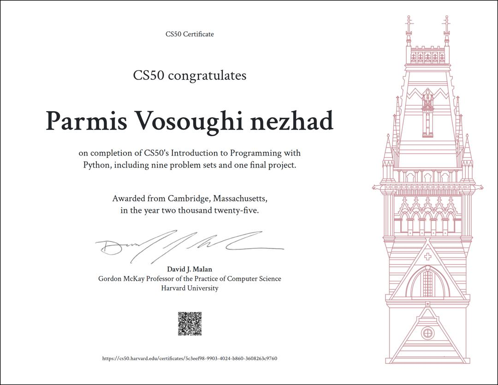

# 🧠 SC50P – CS50 Python Projects by Parmis Vosoughi nezhad

Welcome to my CS50P repository! This space documents my journey through Harvard's CS50's Introduction to Programming with Python. Each weekly folder contains hands-on projects that reflect my growth in problem-solving, logical thinking, and clean code practices.

---

## 📁 Structure

- `week 1` → Basic Python syntax and meal cost calculator
- `week 2` → String manipulation with `twttr.py`
- `week 3` → Conditional logic in `taqueria.py`
- `week 4` → Function design in `professor.py`
- `week 5–8` → Progressive challenges in loops, data structures, and file handling
- `Final-project` → Capstone demonstrating cumulative skills
- `CS50P-Certificate.jpg` → Proof of completion and commitment

---

## 🧩 Why This Matters

As a Computer Software Engineering student, I approach each project with a strategic mindset—balancing clarity, efficiency, and scalability. This repo isn't just coursework; it's a reflection of my technical evolution and my commitment to thoughtful engineering.

---

## 🛠️ Skills Demonstrated

- Python fundamentals: variables, conditionals, loops, functions
- File I/O and data handling
- Debugging and test-driven development
- Clean code and modular design

---

## 📜 Certificate

---

> “Code is more than syntax—it's a reflection of how we think.”  
> — Parmis Vosoughinejad

